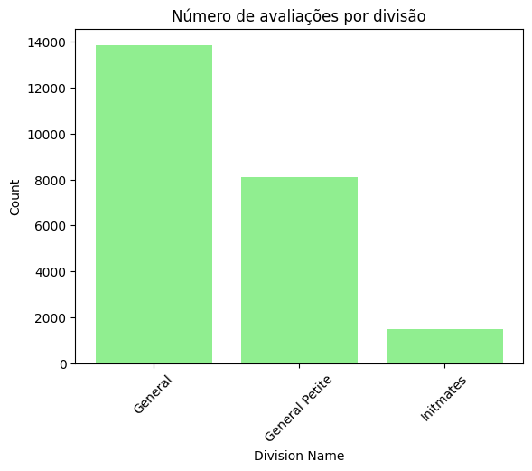
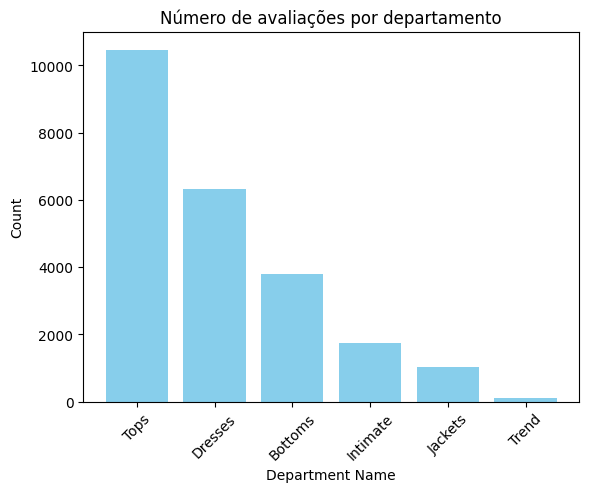

# Análise de Avaliações — E-commerce de Moda Feminina

Análise exploratória de 23.486 avaliações de clientes de um e-commerce de roupas femininas, com um modelo de classificação que prevê, a partir do texto da avaliação, se a cliente recomenda ou não o produto.

> Projeto de portfólio. Notebook desenvolvido em Google Colab, em Python (pandas, matplotlib, scikit-learn).

---

## Sobre os dados

Dataset público de avaliações reais de um varejista de moda feminina (anonimizado — nomes de marca e produto foram removidos pela fonte).

| | |
|---|---|
| Linhas | 23.486 avaliações |
| Produtos distintos | 1.206 |
| Colunas | 10 |
| Período | não informado na fonte |

**Colunas**

| Coluna | Descrição |
|---|---|
| `Clothing ID` | Identificador do produto avaliado |
| `Age` | Idade da autora da avaliação (18 a 99 anos) |
| `Title` | Título da avaliação |
| `Review Text` | Texto livre da avaliação |
| `Rating` | Nota de 1 a 5 dada pela cliente |
| `Recommended IND` | 1 = recomenda o produto, 0 = não recomenda |
| `Positive Feedback Count` | Quantas pessoas acharam a avaliação útil |
| `Division Name` | Divisão do catálogo (General, General Petite, Initmates) |
| `Department Name` | Departamento (Tops, Dresses, Bottoms, Intimate, Jackets, Trend) |
| `Class Name` | Classe do produto (20 categorias: Dresses, Knits, Blouses…) |

**Qualidade dos dados**

- `Title` ausente em 3.810 registros (16,2%) — campo opcional no formulário
- `Review Text` ausente em 845 registros (3,6%) — removidos na etapa de modelagem, já que o texto é a variável preditora
- `Division/Department/Class Name` ausentes nas mesmas 14 linhas
- 21 linhas totalmente duplicadas
- "Initmates" aparece com erro de digitação na origem (Intimates)

---

## Panorama do catálogo



*A divisão General concentra 59% das avaliações. Initmates, com 1.502, responde por apenas 6% — volume baixo demais para conclusões por produto dentro dessa divisão.*



*Tops e Dresses somam 71% de todas as avaliações. Trend, com 119 registros, é a cauda longa do catálogo — e a única categoria com nota média abaixo de 4,0.*

**Distribuição das notas**

| Nota | Avaliações | % |
|---|---|---|
| 5 ★ | 13.131 | 55,9% |
| 4 ★ | 5.077 | 21,6% |
| 3 ★ | 2.871 | 12,2% |
| 2 ★ | 1.565 | 6,7% |
| 1 ★ | 842 | 3,6% |

**Nota média por departamento**

| Departamento | Nota média | Avaliações |
|---|---|---|
| Bottoms | 4,29 | 3.799 |
| Intimate | 4,28 | 1.735 |
| Jackets | 4,26 | 1.032 |
| Tops | 4,17 | 10.468 |
| Dresses | 4,15 | 6.319 |
| Trend | 3,82 | 119 |

---

## Modelo: prever a recomendação a partir do texto

Classificação binária de `Recommended IND` usando o texto livre da avaliação. Conjunto de teste com 4.698 avaliações.

| Classe | Precision | Recall | F1 | Suporte |
|---|---|---|---|---|
| 0 — não recomenda | 0,67 | 0,71 | 0,69 | 851 |
| 1 — recomenda | 0,93 | 0,92 | 0,93 | 3.847 |
| **Acurácia** | | | **0,88** | 4.698 |
| Média macro | 0,80 | 0,82 | 0,81 | 4.698 |
| Média ponderada | 0,89 | 0,88 | 0,88 | 4.698 |

**Como ler esse resultado.** A acurácia de 88% parece alta, mas a base é desbalanceada: 82% das clientes recomendam. Um modelo que respondesse "recomenda" para toda avaliação já acertaria 82% sem aprender nada. O ganho real do modelo são os **6 pontos acima dessa linha de base** — e, principalmente, o que ele faz na classe minoritária.

É aí que está o valor de negócio: o modelo identifica **71% das clientes insatisfeitas** (recall da classe 0), com 67% de precisão. Ou seja, de cada 10 avaliações negativas, ele encontra 7 — e 3 escapam. Para um time que quer agir sobre insatisfação antes que ela vire devolução ou churn, encontrar 7 em 10 automaticamente, em um volume de milhares de avaliações, é operacionalmente útil. A acurácia global, sozinha, esconde exatamente isso.

---

## Modelo 2: prever a divisão do catálogo a partir do texto

Segunda tentativa, agora prevendo `Division Name` (3 classes) a partir do mesmo texto livre. Mesmo conjunto de teste, 4.698 avaliações.

| Classe | Precision | Recall | F1 | Suporte |
|---|---|---|---|---|
| General | 0,61 | 0,78 | 0,69 | 2.755 |
| General Petite | 0,39 | 0,25 | 0,30 | 1.655 |
| Initmates | 0,66 | 0,34 | 0,45 | 286 |
| **Acurácia** | | | **0,56** | 4.698 |
| Média macro | 0,42 | 0,34 | 0,36 | 4.698 |
| Média ponderada | 0,54 | 0,56 | 0,54 | 4.698 |

**Este modelo não funciona — e isso é o resultado.** A classe General sozinha representa 58,6% do conjunto de teste (2.755 de 4.698). Um classificador que respondesse "General" para toda avaliação, sem aprender nada, atingiria 58,6% de acurácia. O modelo treinado atingiu 56,4%: **desempenho abaixo da linha de base trivial.**

A explicação é conceitual, não técnica. Satisfação está no texto da avaliação — a cliente escreve se gostou ou não, e por isso o Modelo 1 funciona. A divisão do catálogo **não está no texto**: é um atributo do produto, atribuído internamente pelo varejista. Uma avaliação como "amei, caiu super bem" é compatível com qualquer divisão. O modelo tentou aprender um padrão que não existe nos dados de entrada.

O comportamento por classe confirma isso: ele acerta razoavelmente General (recall 0,78) porque é a classe majoritária e ele tende a chutá-la, e desmonta em General Petite (recall 0,25), justamente a classe que exigiria distinguir de fato.

**Contraste entre os dois modelos:**

| | Modelo 1 (recomendação) | Modelo 2 (divisão) |
|---|---|---|
| Acurácia | 0,88 | 0,56 |
| Linha de base (classe majoritária) | 0,82 | 0,59 |
| Ganho sobre a linha de base | **+6 p.p.** | **−3 p.p.** |

Comparar o resultado com a linha de base — e não olhar a acurácia isolada — é o que separa um modelo útil de um que só reproduz o desbalanceamento da base.

> Nota técnica: a saída original inclui uma classe sem rótulo com suporte 2, correspondente a registros com `Division Name` nulo que não foram filtrados antes do treino. Correção pendente.

---

## Principais achados

- **O catálogo é concentrado.** Tops e Dresses respondem por 71% das avaliações. Qualquer iniciativa de melhoria de produto deveria começar por esses dois departamentos, simplesmente porque é onde estão as clientes.
- **A satisfação é alta e pouco variável entre categorias.** As notas médias por departamento ficam todas entre 4,15 e 4,29 — exceto Trend, com 3,82. A diferença entre a melhor e a pior categoria (fora Trend) é de 0,14 ponto, o que sugere que a categoria não é o fator que explica a insatisfação.
- **Trend é o ponto fora da curva.** Menor nota média e menor volume do catálogo. Merece investigação qualitativa, não estatística — 119 avaliações não sustentam conclusão robusta, mas sustentam a decisão de ir ler os textos.
- **O texto da avaliação carrega sinal suficiente para prever a recomendação**, com desempenho bem melhor na classe majoritária (F1 0,93) do que na minoritária (F1 0,69) — o padrão esperado em base desbalanceada.
- **O mesmo texto não carrega sinal sobre a divisão do catálogo.** O modelo de divisão ficou abaixo da linha de base trivial, o que indica que a variável de entrada não contém a informação buscada — um limite dos dados, não do algoritmo.

---

## Conclusão

O texto livre da avaliação, sozinho, prevê a recomendação com 88% de acurácia — mas a métrica que importa aqui é o recall da classe negativa: **7 em cada 10 clientes insatisfeitas são identificadas automaticamente.** Isso permite triagem de avaliações negativas em escala, sem leitura manual de milhares de registros.

A tentativa de prever a divisão do catálogo a partir do mesmo texto falhou, e a comparação entre os dois modelos é o resultado mais interessante do projeto: **a mesma variável de entrada, com a mesma técnica, resolve um problema e não resolve o outro** — porque a informação buscada está presente em um caso e ausente no outro. Nenhum ajuste de hiperparâmetro corrige a ausência de sinal.

Os próximos passos naturais seriam tratar o desbalanceamento do Modelo 1 (reamostragem ou ajuste de peso das classes) para elevar o recall da classe 0, e examinar os termos mais associados à não recomendação — o que transformaria o modelo de uma ferramenta de triagem em um diagnóstico do que, especificamente, está desagradando.

---

## Como executar

**No Google Colab** — sem instalar nada:

[](https://colab.research.google.com/github/gabriellecoge/pesquisa-cliente/blob/main/analise_reviews_ecommerce.ipynb)

**Localmente:**

```bash
git clone https://github.com/gabriellecoge/pesquisa-cliente.git
cd pesquisa-cliente
pip install -r requirements.txt
jupyter notebook
```

## Estrutura do repositório

```
.
├── README.md
├── requirements.txt
├── analise_reviews_ecommerce.ipynb
├── data/
│   └── Womens Clothing ECommerce Reviews.csv
└── images/
    ├── avaliacoes_por_divisao.png
    └── avaliacoes_por_departamento.png
```

## Ferramentas

Python · pandas · numpy · matplotlib · scikit-learn · Google Colab

---

## Fonte dos dados

Women's E-Commerce Clothing Reviews — dataset público disponível no Kaggle, publicado por Nicapotato sob licença CC0 (domínio público). Os dados são reais e foram anonimizados pela fonte.

---

**Gabrielle Corrêa Gomes**
[LinkedIn](https://linkedin.com/in/gabriellecorreagomes) · [GitHub](https://github.com/gabriellecoge)
